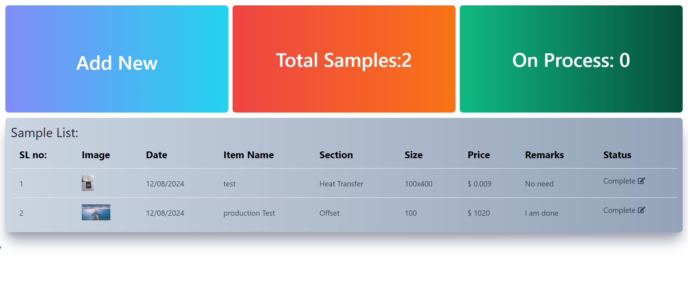

## Sample tracking app

This is a React web based app based on a small concept I wanted to do. I was focused to use my new skills like 
- ts
- mongoose
- mongodb Compass

All these features are are used in backend, the feontend is still in react and jsx.

### [Check it out](https://activesample-tracking.netlify.app/)
